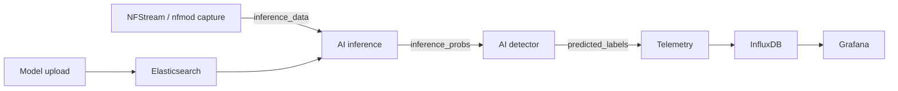

# ACROSS TC3.5 — Heavy Hitter Classification

This repository contains the runnable TC3.5 streaming pipeline developed for
the [ACROSS](https://across-he.eu/) project. It classifies NFStream flow
snapshots as normal traffic, benign heavy hitters, or malicious heavy hitters.

The rev4 model, its metadata, the matching NFStream collector, and the
performance-critical `nfmod` extensions are included. The collector publishes
the model's eight-feature schema through the validated JSON contract.
Generated data, packet captures, and environment-specific settings are not
part of the repository.

## Architecture



The default Compose project starts Elasticsearch, the one-shot model uploader,
Kafka, the one-shot topic initializer, inference, and the detector. Packet
capture, monitoring, and training are opt-in profiles because they require
local input or credentials.

## Bundled rev4 model

The active artifact is:

```text
random_forest_train_ceos2_eth3_rev4_ronda1_t_lim_0.5s_20estimators_all.joblib
```

- SHA-256:
  `105452e85dd7e7b3b41e5cd765a9333d8894d4d257e83f23e65b6b016704b315`
- Random forest estimators: 20
- Snapshot interval: 0.5 seconds
- Classes: `normal_traffic`, `benign_heavy_hitter`,
  `malign_heavy_hitter`
- Serialization library: scikit-learn 1.0.2 / joblib

At startup, `model-upload` stores the model in Elasticsearch under its SHA-256
document ID. `ai-inference` waits for the configured filename, downloads it,
verifies both the repository checksum and the pinned checksum, validates the
feature schema, and then loads it automatically. An exited
`model-upload` container with status code 0 is expected.

Inference uses buffered execution: each replica gathers
up to 900 snapshots while Kafka has backlog, flushes a partial batch on the
first empty non-blocking poll, and then sleeps 1 ms before polling again. It
performs one vectorized `predict_proba()` call and publishes one JSON batch;
Kafka input offsets are committed only after that output is acknowledged.

The bundled metadata reports:

| Metric | Macro | Weighted |
| --- | ---: | ---: |
| F1 | 0.8988 | 0.9947 |
| Precision | 0.8584 | 0.9949 |
| Recall | 0.9568 | 0.9946 |
| Accuracy | 0.9946 | 0.9568 |

## NFStream input schema

The declared feature-name sequence is part of the model contract. JSON object
keys may arrive in any order and are normalized to that sequence; inference
rejects missing, extra, incorrectly declared, nonnumeric, or non-finite
inputs.

| Position | Feature |
| ---: | --- |
| 1 | `udps.protocol` |
| 2 | `udps.src2dst_last` |
| 3 | `udps.dst2src_last` |
| 4 | `udps.src2dst_pkts_data` |
| 5 | `udps.dst2src_pkts_data` |
| 6 | `src2dst_bytes` |
| 7 | `dst2src_bytes` |
| 8 | `udps.diff_dst_src_first` |

The directional `last` and first-packet-difference fields use NFStream's
millisecond timestamps. Packet counters include payload-bearing packets, and
byte counters are cumulative for the flow, matching the rev4 feature
semantics.

The collector runs the NFStream 6.5.3 `nfmod` extensions with six meter worker
processes.
Capture work is divided between those processes, and each meter owns a Kafka
producer configured with 32 KiB batches, `linger_ms=10`, `gzip`, and a bounded
flush every 900 processed packets. Messages remain strict JSON; the unsafe
pickle-based wire format is not used. The public `nfstream==6.5.3` wheel is
still installed because it supplies the native `_lib_engine` binary used by
the fork.

## Requirements

- Docker Engine with Docker Compose v2
- At least 4 GB of free memory for the core stack without packet capture
- A Linux host for live interface capture
- A PCAP supplied by the user for offline capture

The full-size configuration for a high-cardinality 25 GB PCAP
uses 6 NFStream meters, 8 Kafka partitions, 8 inference consumers, and 4
detector consumers. Six meters require at least 7 logical CPUs visible inside
the capture container merely to avoid NFStream reducing the count. The
`nfmod` affinity policy assigns CPUs in pairs, so 14 logical CPUs are
recommended to avoid overlap between the streamer and six meters. RAM and
storage must also be sized for the PCAP's concurrent-flow cardinality and
Kafka/monitoring retention; the 4 GB minimum above is not a paper-scale
capture target.

The repository intentionally does not include traffic captures.

On Linux, replace `TC35_OUTPUT_UID` and `TC35_OUTPUT_GID` in `.env` with the
numeric results of `id -u` and `id -g` when your account is not UID/GID 1000.
The detector and telemetry containers remain non-root and use those IDs to
write their CSV bind mounts.

## Quick start

Copy the environment template and change the local-only credentials:

```sh
cp .env.example .env
```

On PowerShell:

```powershell
Copy-Item .env.example .env
```

Start the core services:

```sh
docker compose up --build -d
docker compose ps -a
```

Useful checks:

```sh
docker compose logs -f ai-inference ai-detector
docker compose exec kafka /opt/kafka/bin/kafka-topics.sh \
  --bootstrap-server kafka:9092 --list
curl 'http://127.0.0.1:9200/models/_search?_source_excludes=file_data.file_content'
```

Kafka and Elasticsearch host ports bind only to `127.0.0.1`. Containers use
the isolated Compose network and service names internally.

Stop the stack without deleting persistent volumes:

```sh
docker compose down
```

Add `--volumes` only when you intentionally want to erase Kafka,
Elasticsearch, InfluxDB, Grafana, and downloaded-model state.

## Capture traffic

Only capture traffic on networks you own or are authorized to monitor.

### Offline PCAP

Place a non-empty capture in `nfstream/pcaps/`, then set, for example:

```dotenv
PCAP_FILENAME=example.pcap
CAPTURE_MODE=pcap-freno
MONITORED_DEVICE=example-device
```

Start the capture profile:

```sh
docker compose --profile capture up --build
```

The defaults use 6 meters, 8 Kafka partitions, 8 inference replicas, and 4
detector replicas, matching the experiment topology. Keep
`NFSTREAM_REQUIRE_EXACT_METERS=true` for a paper-scale run;
`AI_INFERENCE_REPLICAS` and `AI_DETECTOR_REPLICAS` can reduce the consumer
counts for development hosts.

Follow capture, inference, and detector progress in another terminal:

```sh
docker compose logs -f nfstream ai-inference ai-detector
```

If fewer than 7 allowed logical CPUs are visible, NFStream cannot run all six
meters alongside the streamer. The default exact-meter setting aborts instead
of silently reducing that count. Because the `nfmod` affinity policy assigns
CPUs in pairs, 14 visible logical CPUs are recommended. Kafka topics are
created with eight partitions by default.

Supported offline modes:

- `pcap`: process the file as quickly as NFStream can read it.
- `pcap-realtime`: pace emitted snapshots exactly against capture timestamps.
- `pcap-freno`: paced experiment replay; permit snapshots to run at
  most 0.25 seconds of wall-clock lead.

The service validates that the configured file exists and is non-empty, then
exits normally at end of file. An interrupted capture exits with status 130 so
an incomplete 25 GB run is not mistaken for success; forced termination may
discard Kafka records that were still buffered.

### Live Linux interface

Set the real host interface in `.env`:

```dotenv
CAPTURE_INTERFACE=eth0
MONITORED_DEVICE=my-host
```

Then use the explicit live-capture override:

```sh
docker compose \
  -f docker-compose.yml \
  -f docker-compose.live.yml \
  --profile live-capture \
  up --build
```

This is the only service that uses host networking and the `NET_RAW` /
`NET_ADMIN` capabilities. Live host-interface capture is not portable to
Docker Desktop on Windows.

## Detector output and monitoring

Each detector replica writes one semicolon-delimited CSV row per classified
snapshot under `ai-detector/output/`. The file records the capture timestamp,
connection tuple, label, probabilities, and input features; its replica-safe
filename includes the client ID, hostname, UTC start time, and process ID.

The capture and live-capture profiles start the restored InfluxDB/Grafana path
automatically. It can also be started independently:

```sh
docker compose --profile monitoring up --build -d
```

- Grafana: <http://127.0.0.1:3000>
- InfluxDB: <http://127.0.0.1:8086>

Credentials come from `.env`; the values in `.env.example` are placeholders
for local development. The provisioned pipeline and dashboard intentionally
use the fixed bucket name `monitoring`. Telemetry calculates
5-second event-time windows, including per-class bytes, packets, snapshots,
mean confidence, security ratio, unique heavy-hitter/DDoS connections, input
quality counters, and end-to-end stage latencies. The corresponding interval
and per-snapshot latency CSV files are written under
`intelligent-telemetry/output/` as `retrasos_intervalo.csv` and
`retrasos_snapshot.csv`.

During an experiment, follow all active application logs in a terminal:

```sh
docker compose logs -f nfstream ai-inference ai-detector intelligent-telemetry
```

## Optional training service

Training is not needed to run the bundled model. To enable the local-only API:

```sh
docker compose --profile training up --build -d ai-training
```

It listens on <http://127.0.0.1:5050>. Dataset IDs may contain letters,
numbers, dots, underscores, and hyphens. Put these files in
`ai-training/data/`:

```text
<dataset_id>_training.csv
<dataset_id>_validation.csv
```

Both files must be `*`-delimited, include `category`, and resolve to the exact
eight NFStream features above after metadata columns are removed. Accepted
legacy category values are `Benign_traffic`, `Benign_HH`, and `Malign_HH`;
published predictions use the canonical names shown under the bundled model.

```sh
curl -X POST http://127.0.0.1:5050/train \
  -H 'Content-Type: application/json' \
  -d '{"dataset_id":"ceos2_eth3_rev4","n_estimators":20}'
```

`n_estimators` must be an integer from 1 to 1000. Trained artifacts are also
published idempotently by SHA-256 with their feature schema and 0.5-second
snapshot contract.

Retraining uses metadata from an existing catalog entry without deserializing
that old artifact. By default it keeps the original estimator count; include
`n_estimators` to override it:

```sh
curl -X POST http://127.0.0.1:5050/retrain \
  -H 'Content-Type: application/json' \
  -d '{"model_id":"<sha256>","new_dataset_id":"ceos2_eth3_rev5","n_estimators":50}'
```

## Kafka contract

Kafka values are strict UTF-8 JSON. The legacy pickle/dill transport was
removed because consuming untrusted pickle data can execute arbitrary code.

| Topic | Producer | Consumer | Value |
| --- | --- | --- | --- |
| `inference_data` | NFStream | AI inference | One snapshot, or a supported legacy batch |
| `inference_probs` | AI inference | AI detector | Probability matrix and flattened metadata |
| `predicted_labels` | AI detector | Telemetry | Labels, confidence, timing, and flow metadata |

NFStream publishes one snapshot per Kafka record:

```json
{
  "schema_version": "v1",
  "snapshot_interval_seconds": 0.5,
  "feature_names": [
    "udps.protocol",
    "udps.src2dst_last",
    "udps.dst2src_last",
    "udps.src2dst_pkts_data",
    "udps.dst2src_pkts_data",
    "src2dst_bytes",
    "dst2src_bytes",
    "udps.diff_dst_src_first"
  ],
  "data": {
    "features": {
      "udps.protocol": 6,
      "udps.src2dst_last": 500,
      "udps.dst2src_last": 420,
      "udps.src2dst_pkts_data": 4,
      "udps.dst2src_pkts_data": 2,
      "src2dst_bytes": 300,
      "dst2src_bytes": 120,
      "udps.diff_dst_src_first": 15
    }
  },
  "metadata": {
    "timestamp": 1720000000500,
    "timestamp_nfstream": 1720000000.6,
    "monitored_device": "example-device",
    "interface": "example.pcap",
    "connection_id": {
      "src_ip": "192.0.2.1",
      "dst_ip": "198.51.100.2",
      "src_port": 12345,
      "dst_port": 443,
      "protocol": 6,
      "first": 1720000000000
    },
    "flow_pkts": 6,
    "flow_bytes": 420
  }
}
```

Kafka headers repeat `version=v1` and the ordered `features_names` value for
compatibility with the producer contract. Consumers read headers by name and
iterate every partition returned by Kafka. Fresh durable consumer groups start
at the earliest retained record, and offsets are committed only after the next
pipeline stage succeeds. Invalid JSON or contract records are logged and
deliberately skipped.

## Configuration

The most useful settings are in `.env.example`:

| Variable | Default | Purpose |
| --- | --- | --- |
| `KAFKA_TOPIC_PARTITIONS` | `8` | Topic partitions; existing topics can only grow |
| `CAPTURE_MODE` | `pcap-freno` | Offline/realtime/live capture mode |
| `PCAP_FRENO_MAX_LEAD_SECONDS` | `0.25` | Maximum replay lead over wall clock |
| `PCAP_FILENAME` | `capture.pcap` | File under `nfstream/pcaps/` |
| `CAPTURE_INTERFACE` | empty | Linux interface for live capture |
| `MONITORED_DEVICE` | `unknown` | Device tag attached to events |
| `NFSTREAM_METERS` | `6` | Requested `nfmod` meter process count |
| `NFSTREAM_REQUIRE_EXACT_METERS` | `true` | Fail instead of reducing meters when CPUs are insufficient |
| `AI_INFERENCE_REPLICAS` | `8` | Default inference consumer count |
| `AI_DETECTOR_REPLICAS` | `4` | Default detector consumer count |
| `INFERENCE_BATCH_SIZE` | `900` | Vectorized inference batch size |
| `INFERENCE_IDLE_POLL_SECONDS` | `0.001` | Sleep after an empty poll flushes a partial batch |
| `TC35_OUTPUT_UID`, `TC35_OUTPUT_GID` | `1000` | Linux owner IDs for detector/telemetry CSV bind mounts |
| `MAX_POLL_RECORDS` | `500` | Detector batches fetched per telemetry poll |
| `MONITORING_WINDOW_SECONDS` | `5` | Monitoring event-time interval |
| `ALLOWED_LATENESS_SECONDS` | `5` | Accepted lateness for the preceding interval |
| `IDLE_FLUSH_SECONDS` | `1` | Idle time before a pending monitoring window is flushed |
| `REBASE_EVENT_TIME` | `true` | Rebase historical PCAP timestamps to observation time |
| `KAFKA_MAX_PENDING_SENDS` | `1000` | Per-worker Kafka backpressure bound |
| `KAFKA_BATCH_SIZE` | `32768` | Per-meter producer batch size in bytes |
| `KAFKA_LINGER_MS` | `10` | Per-meter producer batching delay |
| `KAFKA_COMPRESSION_TYPE` | `gzip` | Kafka value-batch compression |
| `KAFKA_FLUSH_PACKET_INTERVAL` | `900` | Maximum processed packets between producer flushes |
| `KAFKA_CLEANUP_FLUSH_FLOW_INTERVAL` | `300` | Flow expirations between cleanup flushes |
| `KAFKA_ACKS` | `1` | Producer acknowledgement policy |
| `KAFKA_RETRIES` | `0` | Preserve snapshot order under the configured producer policy |
| `INFLUX_USERNAME`, `INFLUX_PASSWORD`, `INFLUX_ORG`, `INFLUX_TOKEN` | local placeholders | Monitoring initialization |
| `GRAFANA_ADMIN_*` | local placeholders | Grafana login |

The bundled filename, SHA-256 trust pin, and `T_LIM=0.5` are fixed in Compose.
Changing any of them requires an intentional code/configuration update and a
matching metadata file; a filename-only environment override is not accepted.

## Tests

The test suite checks the JSON contract, all-partition iteration, exact feature
order, idempotent model upload, checksum verification, detector/telemetry
handoff, and an actual `predict_proba()` call against the bundled artifact.
Use Python 3.10 for host-side tests because the artifact requires the pinned
scikit-learn 1.0.2 runtime; the Docker and CI configurations already do so.

```sh
python -m pip install -r requirements-dev.txt
python -m unittest discover -s tests -v
docker compose config --quiet
```

With the core stack running, exercise an actual Kafka inference-to-detector
round trip from the host:

```sh
python tests/smoke_pipeline.py
```

CI builds every custom image, validates both Compose variants, runs the unit
and artifact tests (including `nfmod` producer/flush behavior), exercises the
native engine over a small PCAP through `nfmod` multiprocessing, and runs this
core pipeline smoke test.

## Repository layout

```text
.
├── ai-detector/             # probability-to-label Kafka service
├── ai-inference/            # checksum-pinned model inference
├── ai-repository/           # Elasticsearch image
├── ai-training/             # optional training API
├── grafana/                 # dashboard and datasource provisioning
├── intelligent-telemetry/   # JSON Kafka to InfluxDB
├── kafka/                   # idempotent topic initialization
├── model-upload/            # bundled model, metadata, uploader
├── nfstream/                # restored collector and vendored nfmod fork
├── tc35_contract/           # shared versioned message/schema contract
├── tests/
├── docker-compose.yml
└── docker-compose.live.yml
```

The obsolete Tstat `data_aggregator` was removed because it is incompatible
with the bundled NFStream model and is not part of the rev4 runtime.

## Security and deployment scope

This Compose setup is intended for local research:

- Application containers run as non-root, drop capabilities, and use
  read-only filesystems where practical.
- Model downloads require a known checksum before the joblib artifact is
  deserialized.
- Elasticsearch security and Kafka transport encryption are still disabled
  inside the local bridge network.
- Published ports bind to localhost only.
- Production deployment requires authenticated/TLS Kafka and Elasticsearch,
  managed secrets, resource limits, backups, and network policy.

## Publication and dataset

This work accompanies:

> *On the Applicability of Network Digital Twins in Generating Synthetic Data
> for Heavy Hitter Discrimination*, IEEE Communications Magazine,
> <https://doi.org/10.1109/MCOM.003.2400648>.

```bibtex
@ARTICLE{11020584,
  author={Karamchandani, Amit and Nunez, Javier and de-la-Cal, Luis and Moreno, Yenny and Mozo, Alberto and Pastor, Antonio},
  journal={IEEE Communications Magazine},
  title={On the Applicability of Network Digital Twins in Generating Synthetic Data for Heavy Hitter Discrimination},
  year={2025},
  pages={2-8},
  doi={10.1109/MCOM.003.2400648}
}
```

Related datasets are available from
[Zenodo](https://zenodo.org/records/14134646).

## Contact

Amit Karamchandani Batra, Universidad Politécnica de Madrid —
[amit.kbatra@upm.es](mailto:amit.kbatra@upm.es)

This repository is for academic and research use. Users are responsible for
complying with applicable law and obtaining authorization before capturing or
processing network traffic.
